# Elina Wang

AI agents · RAG systems · thoughtful product interfaces

---

### Now

- Building small, useful AI products around agents, memory, and retrieval.
- Designing chat and voice interfaces that are clear enough to ship.
- Exploring uncertainty-aware modeling for decision support.

### Selected work

  
  

  
  

### Metrics

  

